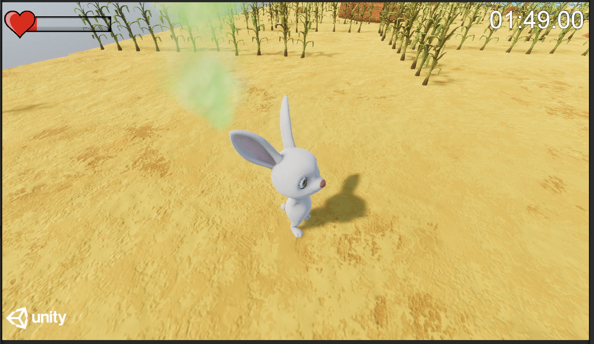

# CSYE-7270
### Final Project for CSYE 7270 in NEU
Yue FANG, NUID 001584481

#### Start the Project

Please Select **No** when the warning pop up.

#### How to Play
- `WASD` or `⬆️⬇️⬅️➡️`  to control the player.
- Press left 'Shift' for *Sprinting*, `Space` for *Jumping*
- Find the *Teleporter* to win the **Level**, and the *Teleporter* will take you to the next **Level**
- Avoid to get in touch with the **Damage Object**, such as *Poison Smoke*, *Lake*, *Fire*, *Sparks* and also avoid to *fall down* from tall buildings. 
- Press `esc` to *Pause*

#### Game Features
1. Menu Systems

2. Damage Systems

When player lose health, the health bar will turn from green to yellow then to red.

3. Levels

Level 1 is in Cornfield

Level 2 is on Roof of Buildings

4. Score Systems

Player will get different scores according to the playing time.

5. Animations

Play have *Idle*, *Walk*, *Run*, *Jump*, *Hurt*, and *Die* Animations.

Details in the Play video.

